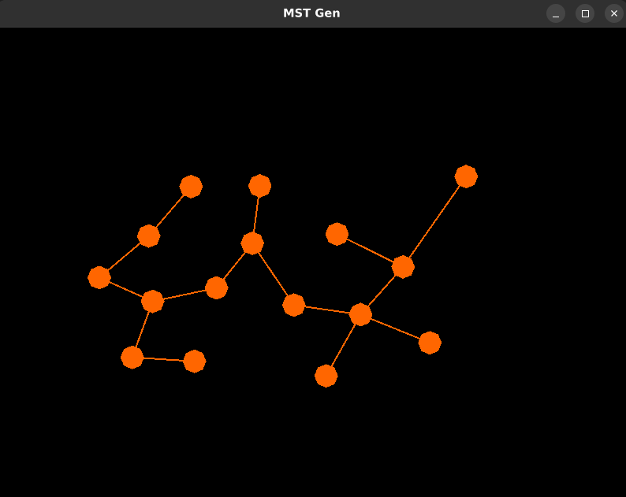

# MST Gen

This is a little novelty project. You are able to click the screen and add nodes, and the program will generate and display the minimum spanning tree of the nodes using Prim's algorithm. Releases are available for Linux and Windows.

Written in Rust using the ggez library.

